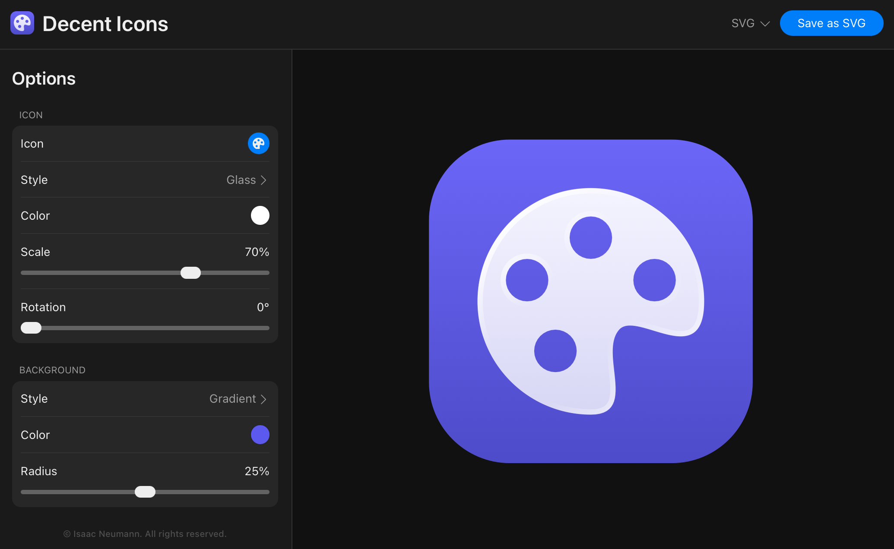

# Decent Icons
**Try it out:** [syntask.github.io/decent-icons](https://syntask.github.io/decent-icons/)

A simple online tool for creating app icons. Start by selecting a symbol from the built-in [Bootstrap Icons](https://icons.getbootstrap.com/) library. Then select you color and style options and export it as an SVG or PNG file.